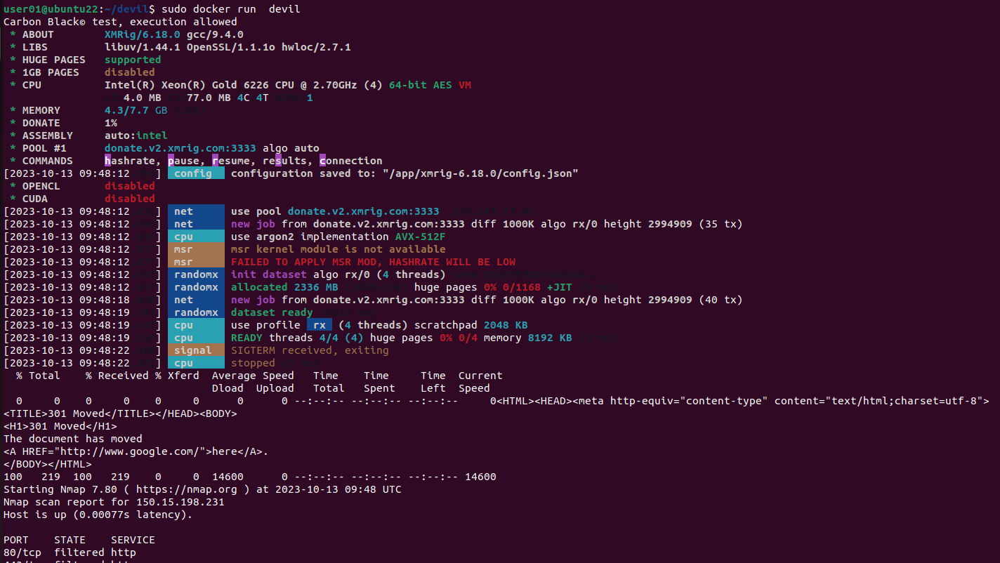
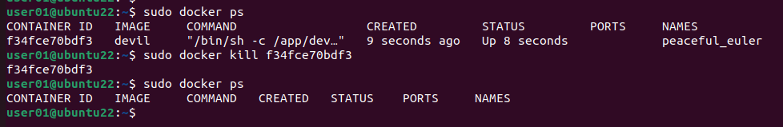
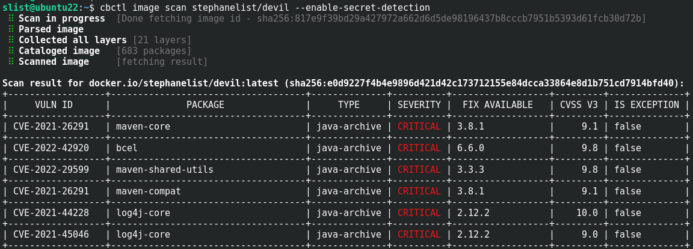
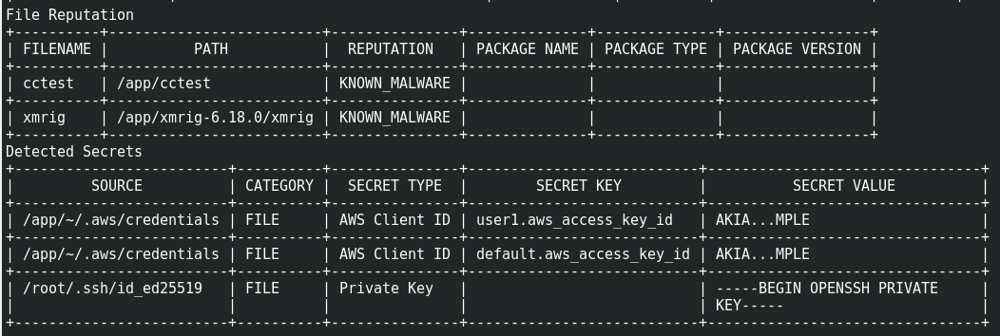

# Carbon Black Container devil image

## Introduction

In order to test all the great features of Carbon Black Container, you need to put on the hat of a bad and malicious developer for a few minutes. With this little piece of code, you will create a malicious container image that is *not* dangerous, but will perform some malicious actions:

* run a fake Linux malware: cctest.

* run a cryptominer (xmrig) during a few seconds.

* portscan internal and external

* run as root

* contains secrets: private keys

If you are a Docker absolute beginner, I recommend to watch a video about Docker, for example, this [video](https://www.youtube.com/watch?v=pg19Z8LL06w) that I have found very helpful.

And if you want this malicious devil image it's already available on [DockerHub](https://hub.docker.com/repository/docker/stephanelist/devil)

### Install Docker

You can use [Docker](https://www.docker.com/) or [Docker Desktop](https://www.docker.com/products/docker-desktop/) on Windows, Mac, Linux. My prefered method is to use the latest long term [Ubuntu](https://ubuntu.com/) in a VM, so Ubuntu 22.04, and to use Docker provided by the distro.

``` sh
sudo apt update
sudo apt install git vim
sudo apt install docker.io
```

Check that Docker is running

``` sh
sudo docker -v
```

You should see something like:
``` sh
user01@ubuntu22:~/devil$ sudo docker -v
Docker version 24.0.5, build 24.0.5-0ubuntu1~22.04.1
```

## The Dockerfile

A [Dockerfile](https://docs.docker.com/engine/reference/builder/) is a text document that contains all the commands a user could call on the command line to assemble an image. 

Each new line in the Dockerfile creates a new layer in the container image. So you start with the first layer, the "FROM" which is an old Ubuntu container where we can install an old vulnerable log4j, and we will stack up other malicious applications, and some secrets (passwords, SSH/GitHub/AWS private keys...)

You can get all files using my GitHub repo:
``` sh
git clone https://github.com/slist/devil
cd devil
```
Please take time to read the Dockerfile, it is heavily commented!

## The malicious script

And finaly, the "devil.sh" script will run when we run the container in docker or in Kubernetes.

As you can see, all comand lines are limited by a timeout, so you will not mine crypto too long.

Please take time to read the script "devil.sh", it is heavily commented!


## Build the container image

We will use "docker build" to build the container image. It is deprecated and will be replaced by [buildx](https://docs.docker.com/build/architecture/#install-buildx) in the future.

``` sh
sudo docker build . -t devil
```

## Test the container image with Docker

``` sh
sudo docker run devil
```



In another terminal, list all your running containers, and kill the devil container.
``` sh
sudo docker ps
sudo docker kill <container id>
```




## Push the container image to a container registry

You can use [Docker Hub](https://docs.docker.com/docker-hub/quickstart/) for example.

In the following example, replace "stephanelist" with your name.

``` sh
sudo docker login
sudo docker build -t stephanelist/devil .
sudo docker push stephanelist/devil
```
You should now have you container image on [DockerHub](https://hub.docker.com/repository/docker/stephanelist/devil/general)

## Scan your container image with Carbon Black CLI tool : cbctl

``` sh
cbctl image scan stephanelist/devil --enable-secret-detection
```



the [CVE-2021-44228](https://nvd.nist.gov/vuln/detail/CVE-2021-44228) is the CVE well known for the log4j critical vulnerability (CVSS score = 10).

...



All malwares and secret keys have been detected too.

## Run your container image in a Kubernetes Cluster protected by Carbon Black

Run the container image in a new namespace called devil:
``` sh
kubectl create ns devil
kubectl create deployment devil --image stephanelist/devil -n devil
```

## Clean up your Kubernetes cluster

``` sh
kubectl delete deployment devil -n devil
kubectl delete ns devil
```


## Support

If you have questions, please contact me at: slist at vmware dot com
